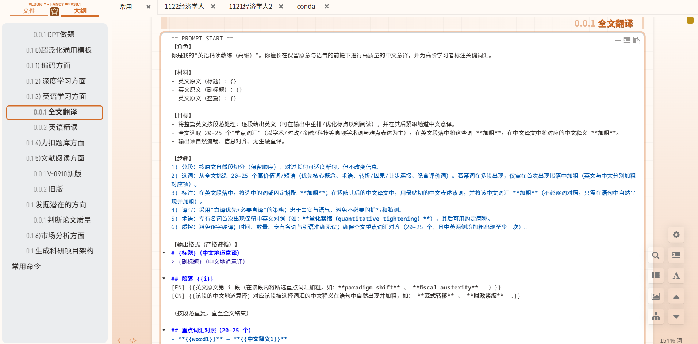
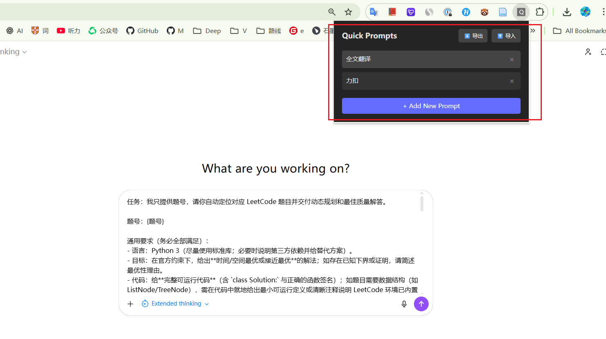

# Quick Prompt Filler - 快捷提示词填充器

一个简洁高效的 Chrome 浏览器扩展，支持在 ChatGPT、Gemini 和 Claude 网页上快速填充自定义提示词。

## 使用效果

1.最先开始使用的是复制粘贴Prompt的方法



2.软件使用界面，支持导入导出



## ✨ 功能特性

- 🚀 **一键填充**：点击提示词标题即可快速填充到输入框
- 📝 **自定义管理**：轻松添加、编辑、删除和管理你的提示词库
- ↕️ **拖拽排序**：支持拖拽移动单个提示词，调整顺序
- 💾 **导入导出**：支持 Markdown 格式的批量导入导出
- 🎯 **多平台支持**：完美适配 ChatGPT、Gemini 和 Claude
- ℹ️ **内容详情**：点击“i”按钮查看提示词完整内容
- 📋 **格式保留**：自动保留 Markdown 格式，包括换行和标题

## 📦 安装方法

### 从源码安装

1. 克隆或下载本项目
2. 安装依赖并构建：
   ```bash
   npm install
   npm run build
   ```
3. 打开 Chrome 浏览器，访问 `chrome://extensions/`
4. 开启右上角的"开发者模式"
5. 点击"加载已解压的扩展程序"
6. 选择项目中的 `dist` 文件夹

## 🎯 使用说明

### 添加提示词

1. 点击浏览器工具栏中的扩展图标
2. 点击"+ Add New Prompt"按钮
3. 输入标题和内容
4. 点击"Save"保存

### 编辑与排序

- 点击提示词右侧的“✎”按钮可编辑并保存单个提示词
- 点击“i”按钮可查看提示词完整内容
- 按住“⋮⋮”拖拽手柄可移动提示词顺序

### 使用提示词

1. 打开 ChatGPT、Gemini 或 Claude 网页
2. 点击扩展图标打开弹窗
3. 点击任意提示词标题，内容将自动填充到输入框

### 导入导出

**导出：**
- 点击"⬇️ 导出"按钮
- 自动下载 Markdown 格式的提示词文件

**导入：**
- 点击"⬆️ 导入"按钮
- 选择 `.md` 文件
- 确认后自动合并到现有提示词

### Markdown 导出格式

```markdown
**TITLE:** 提示词标题

**CONTENT:**
提示词内容...
可以包含任何 Markdown 格式

---

**TITLE:** 另一个提示词

**CONTENT:**
更多内容...
```

## 🛠️ 技术栈

- **框架**：React 18 + TypeScript
- **构建工具**：Vite
- **存储**：Chrome Storage API
- **样式**：原生 CSS

## 📝 开发说明

### 项目结构

```
fill_prompt/
├── src/
│   ├── App.tsx          # 主应用组件
│   ├── App.css          # 样式文件
│   ├── content/
│   │   └── index.ts     # 内容脚本（页面注入）
│   └── types.ts         # TypeScript 类型定义
├── public/
│   └── manifest.json    # Chrome 扩展配置
└── dist/                # 构建输出目录
```

### 开发命令

```bash
# 安装依赖
npm install

# 开发模式（监听文件变化）
npm run dev

# 构建生产版本
npm run build

# 代码检查
npm run lint
```

## 🌟 特色功能详解

### 智能文本填充

- **ChatGPT**：支持最新的 contenteditable 输入框
- **Claude**：使用 ProseMirror 编辑器，完美保留格式
- **Gemini**：兼容多种选择器，确保稳定性

### 格式保留技术

使用 `document.execCommand('insertText')` API 确保：
- ✅ 换行符正确显示
- ✅ Markdown 格式保留
- ✅ 撤销历史记录完整

### 导入导出设计

采用特殊标记格式（`**TITLE:**` 和 `**CONTENT:**`）而非普通 Markdown 标题，避免与提示词内容中的 Markdown 格式冲突。


---

**提示**：可以从Releases中下载压缩包解压，源码中安装选择项目中的 `dist` 文件夹即可，首次使用建议先添加几个常用提示词，体验一键填充的便捷！
